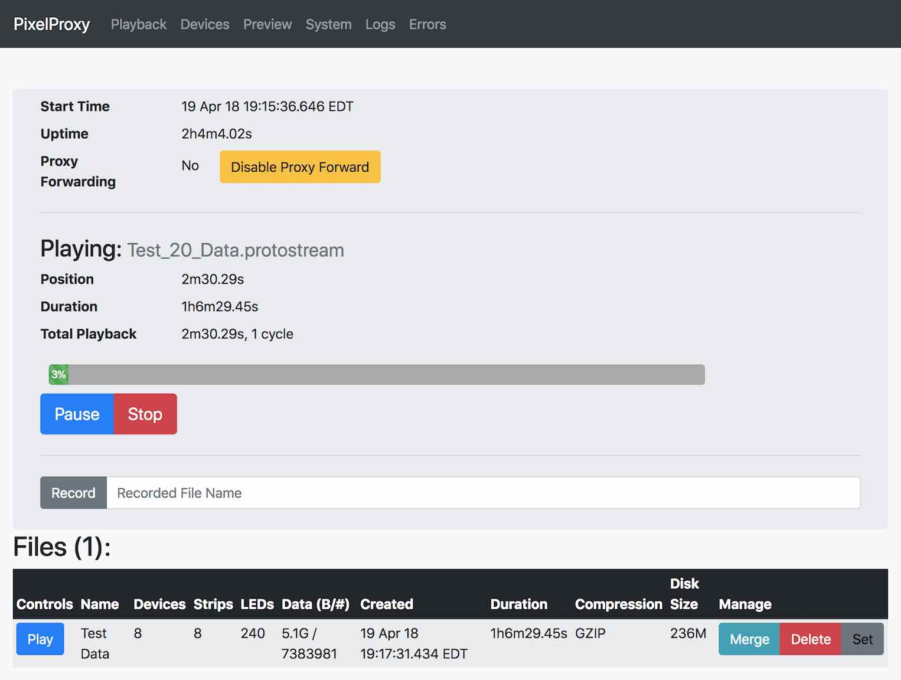
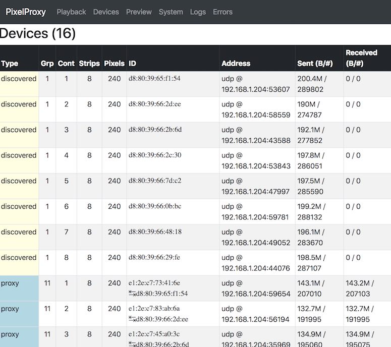
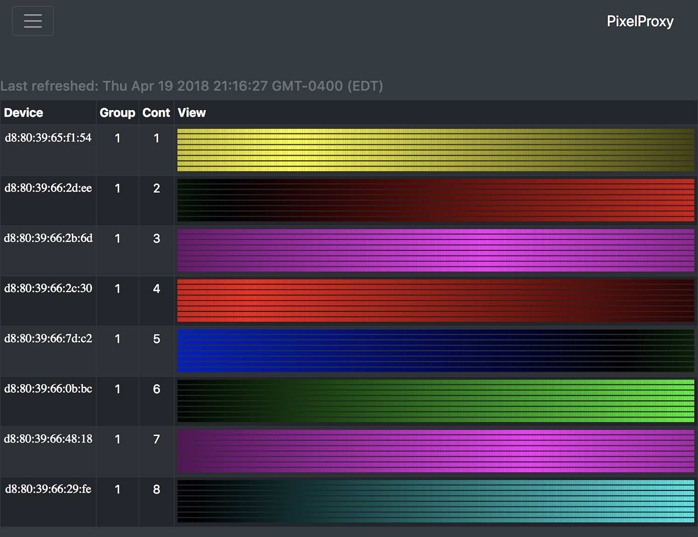

# pixelproxy

[](http://godoc.org/github.com/danjacques/pixelproxy)
[](https://travis-ci.org/danjacques/pixelproxy)

PixelProxy is a single-binary application with a built-in web UI that can:

* Man-in-the-middle devices, reporting stats and state.
* Record and replay data.
* Visualize device state.


It is designed to run on an embedded system in support of a pixel-based
installation.

PixelProxy is built on top of the
[github.com/danjacques/gopushpixels](https://github.com/danjacques/gopushpixels)
client library.

Unlike **gopushpixels**, PixelProxy has not been polished very much. My
apologies for the crude code, but there is some good and useful stuff in there
:)

## Screenshots







## Installation

NOTE: If `pixelproxy` is hosted in a private repository. You may need to
configure Git (and Go) to download that repo over SSH so it can authenticate:

```sh
git config --global url."git@bitbucket.org:".insteadOf "https://bitbucket.org/"
```

Setup a Go environment and download:

```sh
# Setup a Go path (feel free to adjust):
export GOPATH=~/go

# Update PATH to include Go's bin directory.
export PATH=${GOPATH}/bin:${PATH}

# Download the source and dependencies (but do not install).
#
# This also initializes the submodule dependencies.
go get -u -t -d github.com/danjacques/pixelproxy/...
```

## Running from Source

You can run PixelProxy from source with the following command:

```sh
# CD into "PixelProxy" project directory.
cd ${GOPATH}/src/github.com/danjacques/pixelproxy

# Run the "pixelproxy" application.
go run github.com/danjacques/pixelproxy/cmd/pixelproxy/main.go
```

Use the `--help` flag to list help options. An example debugging command-line
might look like:

```sh
# Run the "pixelproxy" application with human-readable verbose logging.
go run ./cmd/pixelproxy/main.go \
    -vdebug --production=false --http_addr=0.0.0.0:8080
```

This will run the PixelProxy server on your system, bound to port `8080`. It
can then be accessed by visiting: http://localhost:8080 .

## Deployment

Prior to deployment, you should bundle up the assets files into a binary
filesystem. This can be done by running:

```sh
go generate github.com/danjacques/pixelproxy/assets
```

Now, produce a binary by running:

```sh
go install github.com/danjacques/pixelproxy/cmd/...
```

The binaries will be in `${GOPATH}/bin`!

## Shutdown Support

PixelProxy has the ability to allow the user to perform system actions. This is
implemented by directly executing shell commands. In order to have these actions
work as intended:

*   The user must have the following commands available on `PATH`:
    *   `sudo`
    *   `shutdown`
*   The user's `sudoers` config must allow no-password execution of the
    `shutdown` command. This can be implemented adding an `/etc/sudoers`
    configuration line:

    ```
    user_name ALL=(ALL) NOPASSWD: /sbin/shutdown
    ```

## Resources

*   Java (canonical): https://github.com/robot-head/PixelPusher-java
*   Python: https://github.com/cagerton/pixelpie
*   Node: https://github.com/TheThingSystem/node-pixelpusher
*   C++: https://github.com/q-depot/Cinder-PixelPusher
*   PixelPusher Server: https://github.com/hzeller/pixelpusher-server

## TODO

*   Instrument with [Prometheus](https://prometheus.io/) via
    [Go client library](https://godoc.org/github.com/prometheus/client_golang).
